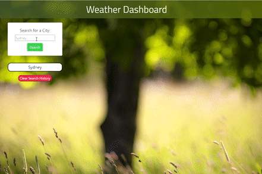

# Weather-Dashboard

## General Information

The deployed Webpage is a Weather Dashboard which allows the user to search for a city to access the current weather conditions as well as to see a 5 day forecast. The webpages data is from the openweathermap api and the html file features dynamically updated HTML, CSS and Bootstrap Grid Layout.

* Deployed URL of the Weather Dashboard: https://zahramertens.github.io/Weather-Dashboard/
* URL of the GitHub Repo: https://github.com/ZahraMertens/Weather-Dashboard.git

## Table if Contents
1. [General Information](#general-informaion)
2. [Task Description](#task-description)
3. [Technologies Used](#technologies-used)
4. [Mock-Up](#mock-up)
5. [Bonus](#bonus)
6. [Credits](#credits)

## Task Describtion

* The Weather Dashboard allows the user to look up the current weather conditions of a location/city by searching its name as well as a 5 day forecast for the same location. The data is retrieved from the OpenWeather API and displayed on the webpage. So as a user I want to see the weather outlook for multiple cities.

## Technologies Used

* HTML

* CSS

* CSS Framework: Bootstrap v5.0.2

* JavaScript

## Actual Behaviour

* WHEN I search for a city THEN I am presented with current and future conditions for that city and that city is added to the search history

* WHEN I view current weather conditions for that city THEN I am presented with the city name, the date, an icon representation of weather conditions, the temperature, the humidity, the wind speed, and the UV index

* WHEN I view the UV index THEN I am presented with a color that indicates whether the conditions are favorable, moderate, or severe

* WHEN I view future weather conditions for that city THEN I am presented with a 5-day forecast that displays the date, an icon representation of weather conditions, the temperature, the wind speed, and the humidity

* WHEN I click on a city in the search history THEN I am again presented with current and future conditions for that city

## 🏆 Bonus

* WHEN I click on the clear search history button the search history gets cleared and the page reloads 

* The user is able to see a polished layout on any screen size/ Responsive layout

## Mock-Up

The following GIF shows the web applications apperance and functionality:

## Credits

* https://openweathermap.org/
* https://developer.mozilla.org/en-US/docs/Web/API/Fetch_API
* https://www.javascripttutorial.net/javascript-fetch-api/
* https://www.digitalocean.com/community/tutorials/
* how-to-use-the-javascript-fetch-api-to-get-data
* https://javascript.info/fetch
* https://youtu.be/SXsaB9TUfkk
* https://getbootstrap.com/
